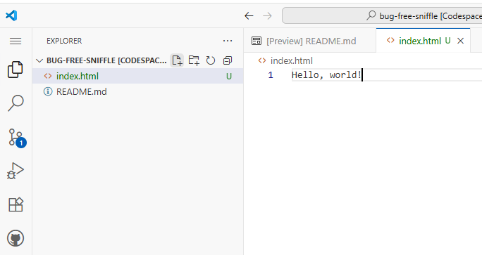

# 👋 Introduction

## About Me

Name
: (Prof.) Calvin (Deutschbein)

Email
: [ckdeutschbein](mailto:ckdeutschbein@willamette.edu)

Website
: [cd-public.github.io](https://cd-public.github.io/)

Field
: Hardware Security, Computer Systems

Pronouns
: They/Them


## Goals

1. Create a *webpage*
2. Make it *stylish*
3. Make it *dynamic*
4. Make it *interactive*
5. Make it *graphical*

## Technologies

- GitHub!
    - The worlds #1 online collaboration platform!
- Three languages.
    - HTML - for text.
    - CSS - for style.
    - JavaScript - for action.

## Today

- [ ] Github!
- [ ] HTML!
- [ ] Create a 📄 webpage

# 📒 Account

## What?

- Create a GitHub account!
    - Use whatever name and password you want...
        - But make sure you remember them!
    - I really recommend using your `.edu` email address!
        - You get extra goodies!

## How?

- [Creating an account on GitHub](https://docs.github.com/en/get-started/start-your-journey/creating-an-account-on-github)
- Or:
    - [ ] Go to [GitHub.com](https://github.com/)
    - [ ] Enter your email.
    - [ ] Click <span style="background-color:green;color:white">Sign up for GitHub</span>
    - [ ] Follow the steps!

## Why?

- GitHub is a great tool for:
    - Learning new technologies.
    - Sharing your projects.
    - Working on projects together.
    - Creating websites or portfolios.
- I wish I'd learned about it sooner!

# 🗃️  Repository

## What?

- Create a GitHub *repository*!
    - How GitHub stores the information in a website
    - Use whatever name you want...
        - But make sure you remember it!
    - (Someday) it will live at:
        - `<account name>.github.io/<repository name>`
        - Check out [cd-example.github.io/bug-free-sniffle/](https://cd-example.github.io/bug-free-sniffle/)

## How?

- [Quickstart for repositories](https://docs.github.com/en/repositories/creating-and-managing-repositories/quickstart-for-repositories)
- Or:
    - Go to [GitHub.com](https://github.com/)
        - It should look different now that you're logged in!
    - Click <span style="background-color:green;color:white"><svg style="filter:invert(1);display:inline-block" xmlns="http://www.w3.org/2000/svg" viewBox="0 0 16 16" width="1em" height="1em"><path d="M2 2.5A2.5 2.5 0 0 1 4.5 0h8.75a.75.75 0 0 1 .75.75v12.5a.75.75 0 0 1-.75.75h-2.5a.75.75 0 0 1 0-1.5h1.75v-2h-8a1 1 0 0 0-.714 1.7.75.75 0 1 1-1.072 1.05A2.495 2.495 0 0 1 2 11.5Zm10.5-1h-8a1 1 0 0 0-1 1v6.708A2.486 2.486 0 0 1 4.5 9h8ZM5 12.25a.25.25 0 0 1 .25-.25h3.5a.25.25 0 0 1 .25.25v3.25a.25.25 0 0 1-.4.2l-1.45-1.087a.249.249 0 0 0-.3 0L5.4 15.7a.25.25 0 0 1-.4-.2Z"></path></svg> New</span>
        - [ ] Give it a name
        - [ ] Add a README file
        - [ ] Click <span style="background-color:green;color:white">Create Repositry</span>

## Why?

::::{.columns}

:::{.column width="65%"}

- Store files that make up a webpages:
    - "HTML" page "content".
    - "CSS" page "formatting".
    - "JS" (JavaScript) "interactivity".
    - We can use images, like PNGs or SVGs.

:::

:::{.column width="35%"}

<a title="Asylum, Atlantic and Warner UK, Public domain, via Wikimedia Commons" href="https://commons.wikimedia.org/wiki/File:Charli_XCX_-_Brat_(album_cover).png"></a>

<p>*An image*</p>

:::

::::

# 🌌 Codespaces

## What?

- Open a GitHub *codespace*!
    - Online code editor
        - Google Docs for code.
    - Has *a lot* of options.
        - We won't use most of them.
        - There's plenty of room to grow!

## How?

- [Creating a codespace for a repository](https://docs.github.com/en/codespaces/developing-in-a-codespace/creating-a-codespace-for-a-repository)
- Or:
    - On the page for the respository you created...
        - `github.com/<account name>/<repository name>`
    - Click <span style="background-color:green;color:white"> <> Code 🔽</span>
    - Click the "Codespaces" tab.
    - Click <span style="background-color:green;color:white">Create codespace on main</span>
    - A new window will open... slowly.
    
## Why?

- Edit files that make up a webpages:
    - "HTML" page "content".
        - We'll do this one first!
        - It is the foundation of all webpages!

# 👋 Hello, World!

## What?

- Now: The first achievement when coding!
- "Hello, world!"
- Within GitHub codespaces, create a new file.
    - It **must** be called `index.html`
    - HTML for "hypertext markup language"
    - The language of the internet!

## How?

- On the left side of the screen, ensure "Explorer" is opened.
    - Two overlapping files <svg style="filter:invert(1)" xmlns="http://www.w3.org/2000/svg" viewBox="0 0 16 16" width="1em" height="1em"><path d="M2 1.75C2 .784 2.784 0 3.75 0h6.586c.464 0 .909.184 1.237.513l2.914 2.914c.329.328.513.773.513 1.237v9.586A1.75 1.75 0 0 1 13.25 16h-9.5A1.75 1.75 0 0 1 2 14.25Zm1.75-.25a.25.25 0 0 0-.25.25v12.5c0 .138.112.25.25.25h9.5a.25.25 0 0 0 .25-.25V6h-2.75A1.75 1.75 0 0 1 9 4.25V1.5Zm6.75.062V4.25c0 .138.112.25.25.25h2.688l-.011-.013-2.914-2.914-.013-.011Z"></path></svg>
- A bar will pop out and at the top there will be a few icons.
    - Click the file with a `+` on it.
    - If missing, "mouseover" repository name!
- Type `index.html` as the name and press enter.
- A new file will open up, type "Hello, world!"

## 👀 Visually



## Why?

- We want to be able to determine what appears on out webpage.
- For now, it matters less *what* we change than *that* we can change the content.
- We'll learn more soon!

# 💾 Save your work!

## What?

- We need changes made in codespaces to become changes in the repository.
    - You may wonder why this isn't automatic: I'm not sure!
- To do so we will change from the "Explorer" activity to the "Source Control" activity
    - It's the technical term for "keeping track of code"
- Lots of paperwork!

## How?

- Click the <svg style="filter:invert(1)" xmlns="http://www.w3.org/2000/svg" viewBox="0 0 16 16" width="1em" height="1em"><path d="M9.5 3.25a2.25 2.25 0 1 1 3 2.122V6A2.5 2.5 0 0 1 10 8.5H6a1 1 0 0 0-1 1v1.128a2.251 2.251 0 1 1-1.5 0V5.372a2.25 2.25 0 1 1 1.5 0v1.836A2.493 2.493 0 0 1 6 7h4a1 1 0 0 0 1-1v-.628A2.25 2.25 0 0 1 9.5 3.25Zm-6 0a.75.75 0 1 0 1.5 0 .75.75 0 0 0-1.5 0Zm8.25-.75a.75.75 0 1 0 0 1.5.75.75 0 0 0 0-1.5ZM4.25 12a.75.75 0 1 0 0 1.5.75.75 0 0 0 0-1.5Z"></path></svg>
- Click <span style="background-color:blue;color:white"> ✓ Commit </span>
    - I get a box pop-up and say <span style="border: 2px solid black;background-color:gray;color:black;">Always</span>

## 🚨 Alert!

- This pops up :
```{.email filename="COMMIT_EDITMSG"}

# Please enter the commit message for your changes. Lines starting
# with '#' will be ignored, and an empty message aborts the commit.
#
# On branch main
# Your branch is up to date with 'origin/main'.
#
# Changes to be committed:
#	new file:   index.html
#
```

:::{.callout-caution}

We must *name our changes*.

:::

## 🤝 Resolve

- Add any message to the first line:

```{.email filename="COMMIT_EDITMSG"}
Hi it's me :)
### Please enter...
```

- Click the `✓` on the top right.
- Click <span style="background-color:blue;color:white"><svg style="filter:invert(1)" xmlns="http://www.w3.org/2000/svg" viewBox="0 0 16 16" width="1em" height="1em"><path d="M1.705 8.005a.75.75 0 0 1 .834.656 5.5 5.5 0 0 0 9.592 2.97l-1.204-1.204a.25.25 0 0 1 .177-.427h3.646a.25.25 0 0 1 .25.25v3.646a.25.25 0 0 1-.427.177l-1.38-1.38A7.002 7.002 0 0 1 1.05 8.84a.75.75 0 0 1 .656-.834ZM8 2.5a5.487 5.487 0 0 0-4.131 1.869l1.204 1.204A.25.25 0 0 1 4.896 6H1.25A.25.25 0 0 1 1 5.75V2.104a.25.25 0 0 1 .427-.177l1.38 1.38A7.002 7.002 0 0 1 14.95 7.16a.75.75 0 0 1-1.49.178A5.5 5.5 0 0 0 8 2.5Z"></path></svg> Sync Changes 1 ↑ </span>
- Now *go back* to the *repository* page.
    - There should now be an "index.html" there!
    - You may need to refresh/reload.

## Why?

- We don't want just *anyone* or *anything* publish to a website we administer.
    - Spam, broken links, stale memes, etc.
    - Mostly *GitHub* doesn't want that and won't leave it up to us!
- This process requires every change to be intentional.
    - I would rather it's easier, but that's okay!
    - It gets better every year!

# 📺 Publish

## What?

- Let's take `index.html` and make it a webpage!
- We'll use "GitHub Pages"
    - Not too hard to set up...
    - I use it a lot for fun 😬
- You'll be able to show anything you do to friends and family!

## How?

- [Creating a GitHub Pages site](https://docs.github.com/en/pages/getting-started-with-github-pages/creating-a-github-pages-site)
- Or:
    - Back on the *repository* page...
            - `<account name>.github.io/<repository name>`
    - We'll change repository settings.
        - On the top, click on <span style="background-color:white;color:black;"><svg xmlns="http://www.w3.org/2000/svg" viewBox="0 0 16 16" width="1em" height="1em"><path d="M8 0a8.2 8.2 0 0 1 .701.031C9.444.095 9.99.645 10.16 1.29l.288 1.107c.018.066.079.158.212.224.231.114.454.243.668.386.123.082.233.09.299.071l1.103-.303c.644-.176 1.392.021 1.82.63.27.385.506.792.704 1.218.315.675.111 1.422-.364 1.891l-.814.806c-.049.048-.098.147-.088.294.016.257.016.515 0 .772-.01.147.038.246.088.294l.814.806c.475.469.679 1.216.364 1.891a7.977 7.977 0 0 1-.704 1.217c-.428.61-1.176.807-1.82.63l-1.102-.302c-.067-.019-.177-.011-.3.071a5.909 5.909 0 0 1-.668.386c-.133.066-.194.158-.211.224l-.29 1.106c-.168.646-.715 1.196-1.458 1.26a8.006 8.006 0 0 1-1.402 0c-.743-.064-1.289-.614-1.458-1.26l-.289-1.106c-.018-.066-.079-.158-.212-.224a5.738 5.738 0 0 1-.668-.386c-.123-.082-.233-.09-.299-.071l-1.103.303c-.644.176-1.392-.021-1.82-.63a8.12 8.12 0 0 1-.704-1.218c-.315-.675-.111-1.422.363-1.891l.815-.806c.05-.048.098-.147.088-.294a6.214 6.214 0 0 1 0-.772c.01-.147-.038-.246-.088-.294l-.815-.806C.635 6.045.431 5.298.746 4.623a7.92 7.92 0 0 1 .704-1.217c.428-.61 1.176-.807 1.82-.63l1.102.302c.067.019.177.011.3-.071.214-.143.437-.272.668-.386.133-.066.194-.158.211-.224l.29-1.106C6.009.645 6.556.095 7.299.03 7.53.01 7.764 0 8 0Zm-.571 1.525c-.036.003-.108.036-.137.146l-.289 1.105c-.147.561-.549.967-.998 1.189-.173.086-.34.183-.5.29-.417.278-.97.423-1.529.27l-1.103-.303c-.109-.03-.175.016-.195.045-.22.312-.412.644-.573.99-.014.031-.021.11.059.19l.815.806c.411.406.562.957.53 1.456a4.709 4.709 0 0 0 0 .582c.032.499-.119 1.05-.53 1.456l-.815.806c-.081.08-.073.159-.059.19.162.346.353.677.573.989.02.03.085.076.195.046l1.102-.303c.56-.153 1.113-.008 1.53.27.161.107.328.204.501.29.447.222.85.629.997 1.189l.289 1.105c.029.109.101.143.137.146a6.6 6.6 0 0 0 1.142 0c.036-.003.108-.036.137-.146l.289-1.105c.147-.561.549-.967.998-1.189.173-.086.34-.183.5-.29.417-.278.97-.423 1.529-.27l1.103.303c.109.029.175-.016.195-.045.22-.313.411-.644.573-.99.014-.031.021-.11-.059-.19l-.815-.806c-.411-.406-.562-.957-.53-1.456a4.709 4.709 0 0 0 0-.582c-.032-.499.119-1.05.53-1.456l.815-.806c.081-.08.073-.159.059-.19a6.464 6.464 0 0 0-.573-.989c-.02-.03-.085-.076-.195-.046l-1.102.303c-.56.153-1.113.008-1.53-.27a4.44 4.44 0 0 0-.501-.29c-.447-.222-.85-.629-.997-1.189l-.289-1.105c-.029-.11-.101-.143-.137-.146a6.6 6.6 0 0 0-1.142 0ZM11 8a3 3 0 1 1-6 0 3 3 0 0 1 6 0ZM9.5 8a1.5 1.5 0 1 0-3.001.001A1.5 1.5 0 0 0 9.5 8Z"></path></svg> Settings</span>
        - On the left, click on <span style="background-color:white;color:black;"><svg xmlns="http://www.w3.org/2000/svg" viewBox="0 0 16 16" width="1em" height="1em"><path d="M0 2.75C0 1.784.784 1 1.75 1h12.5c.966 0 1.75.784 1.75 1.75v10.5A1.75 1.75 0 0 1 14.25 15H1.75A1.75 1.75 0 0 1 0 13.25ZM14.5 6h-13v7.25c0 .138.112.25.25.25h12.5a.25.25 0 0 0 .25-.25Zm-6-3.5v2h6V2.75a.25.25 0 0 0-.25-.25ZM5 2.5v2h2v-2Zm-3.25 0a.25.25 0 0 0-.25.25V4.5h2v-2Z"></path></svg> Pages</span>
        - In the middle, under branch, change "None" to "Main" via the drop-down menu.

## Visually


## Why?

- We get to examine what we did!

# 🔬 Examine

## What?

- [ ] Check our work.
- [ ] Learn how to see where updates will show up.
    - A few minutes after "Commit+Sync"
- [ ] Tell ourselves we did a good job!


## How?

- `<account name>.github.io/<repository name>`
- Or:
    - Back to <span style="background-color:white;color:black;">&lt;&gt; Code</span>
    - Bottom right, under "Deployments", click `github-pages` 
    - There will be a link on this page under the heading `github-pages`

## Why?

- There's many ways to publish online but this is...
    - Free.
    - *Relatively* quick (minutes, not hours).
    - Powerful enough for interactive, public webpages.
- It also builds *a lot* of valuable skills!

## Today

- [x] Github!
- [x] HTML!
- [x] Create a 📄 webpage

